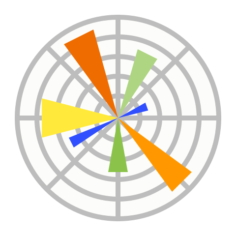

# Hey I'm Mohamed Amine Gabsi 👋

I’m a Second Year Computer Engineering Student at McGill University
I'm passionated by programming and coding. I love creating new projects and always be update about
tech news.

## My Values

⚡ Be active 
💡 Curiosity & learning 
🙌 Teamwork 
🤝 Be respectful and helpful

## 📂 My projects

🎒 <a href="https://github.com/MedAmineGabsi/List-Of-My-Project">List Of My Projects</a>

## Technical Skills:

### Languages:

### Developer Tools:

    

### Libraries/Framework:

