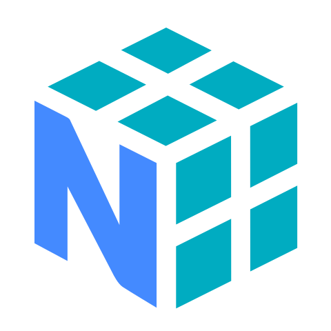
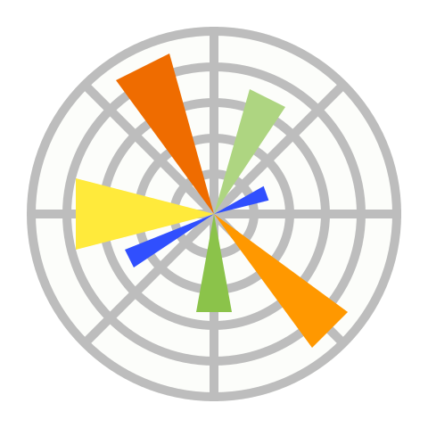

# Bonjour, Hi !

I'm Mohamed Amine Gabsi, a 3rd-year Computer Engineering student at McGill University with a strong interest in software development and building systems that actually work.
From full-stack web applications to CI/CD pipelines and Agile team management, I've had the opportunity to work on projects that go well beyond the classroom. My main stack includes Java, Spring Boot, React, and PostgreSQL, and I'm always eager to learn new tools when the project calls for it.
I enjoy tackling complex problems, writing clean and testable code, and collaborating with people who care about the quality of what they ship.

--------------------------------------------------------------------------------------------------

Je suis Mohamed Amine Gabsi, étudiant en 3e année de génie informatique à l'Université McGill, avec un fort intérêt pour le développement logiciel et la conception de systèmes fiables.
Des applications web full-stack aux pipelines CI/CD en passant par la gestion d’équipe en mode Agile, j’ai eu l’opportunité de travailler sur des projets qui dépassent largement le cadre académique. Mon stack principal : Java, Spring Boot, React et PostgreSQL, et je m’adapte volontiers à de nouveaux outils selon les besoins du projet.
J’aime résoudre des problèmes complexes, écrire du code propre et bien testé, et collaborer avec des personnes qui se soucient de la qualité de ce qu’elles livrent.

## 🧠 My Values

⚡ Be active 
💡 Curiosity & learning 
🙌 Teamwork 
🤝 Be respectful and helpful

## 📂 My projects

<a href="https://github.com/MedAmineGabsi/List-Of-My-Project">List Of My Projects</a>

## 💻 Technical Skills

### Languages:

### Developer Tools:

    

### Libraries/Framework:

