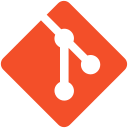

# Hey I'm Amine Gabsi 👋

I’m a junior developper who is actually learning fullstack development
I'm passionated by programming and coding. I love creating new projects and always be update about
technology and political news.

## My Values

⚡ Be active 
💡 Curiosity & learning 
🙌 Teamwork 
🤝 Be respectful and helpful

## Languages and Tools :

---

<table width="100%">
<tr>
<td width="60%">

&nbsp;

</td>
<td width="40%">

</td>
</tr>
</table>
